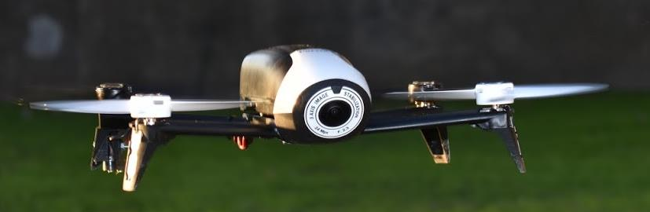

# Descripción y motivación

Una de las temáticas de interés para la aplicación de flotillas de vehículos aéreos no tripulados (drones) es la vigilancia. El objetivo del proyecto es estudiar e implementar una solución para la vigilancia autónoma de un predio por parte de una flotilla de cuadricópteros. 

Los vehículos deben ser capaces de navegar el espacio. Lo que implica la utilización de un patron de vigilancia que se utiliza para reccorer el entorno. Esto hace necesario mecanismos que permitan que cada vehículo deba tener referencia de su ubicación y de las áreas de interez a vigilar. Además de conciderar la precencia de obltaculos y tomar medidas para evitarlos. 

Mediante la utilización de platafromas de carga, los cuadricopteros deben ser capaces de resteblecer sus baterias de forma autonoma. Esto implica la necedidad de conocer la ubicación de dichas platafromas, poder volar hacia el lugar donde se encuentran y poseer un control fino de los movimientos para aterrizar sobre ellas.

Por útlimo los vehículos deben ser capaces de identificar, monitorear y reportar posibles intrusiones. Lo cual implica el poder identificar a un intruso y llevar a cabo las medidas necesarias en el momento de la identificación. 

Todas estas tareas deben realizarse individualmente por cada cuadricoptero, pero siendo parte de una coordinación inteligente entre los integrantes de la flota, sin la intervención de operadores humanos. Toda la flotilla de drones debe comportarse como una única unidad de inteligencia que trabaja de forma coordinada para lograr el objetivo.
