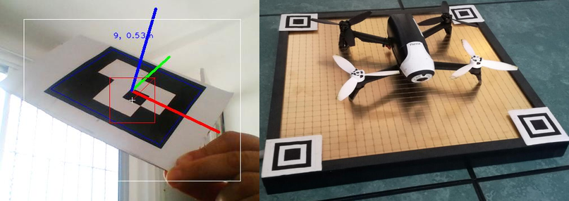

# Navegación y aterrizaje

 

El enfoque utilizado para la navegación fue la utilización de marcadores. Los marcadores son elementos fácilmente reconocibles por el dron mediante el uso de la cámara a bordo. Los marcadores utilizados (ArUco) constan de un grilla binaria nxn que se codifican a un número. Los marcadores son ubicados en una posición conocida y son utilizados para el cálculo de la posición de los drones dentro del predio. 

Cuando un marcador es visualizado por un dron este calcula su posición y rotación utilizando la perspectiva y escala del marcador en la imagen. Luego se toma el promedio de todas las posiciones estimadas y se calcula la posición del dron dentro del predio. Este enfoque requiere que se acondicione previamente el espacio, requieren cuidados adicionales y están sujetos a oclusiones. Sin embargo los algoritmos empleados son computacionalmente mucho más eficientes y permiten un cálculo de posición más preciso. 

Para mantener la flotilla operando en todo momento de forma autónoma se requiere que los drones sean capaces de recargar su batería de forma autónoma. Para esto se utilizó la una plataforma de carga especialmente diseñada que permite que los drones se carguen solo con aterrizar sobre ella. Nuestro trabajo se enfocó en diseñar un algoritmo que sea capáz de localizar la plataforma de carga y aterrizar sobre ella. Este algorimo utiliza marcadores similares a los de navegación, que son ubicados en los extremos de la plataforma. Estos marcadores son utilizados para calcular el centro de la plataforma y alinearse perfectamente sobre ella antes de aterrizar.

