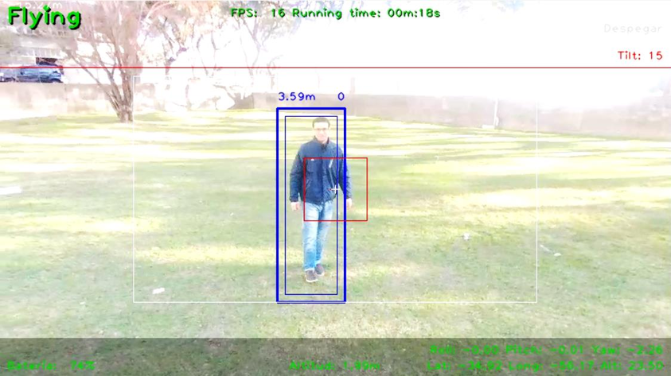

# Percepción del entorno

El tipo de amenaza en el que nos se enfocó el proyecto en identificar fueron las intrusiones humanas. El objetivo fue detectar intrusos y perseguirlos para mantenerlos monitoreados. La solución se basó en la utilización de las imágenes tomadas por la cámara del dron para detectar personas. La detección de intrusos consta de tres tareas: detección, seguimiento y persecución. 

La primera tarea consta en utilizar un algoritmo de procesamiento de imagen expecializado en la detección del la figura humana para detectar a los intrusos. Una vez detectado un intruso se pasa a la segunda etapa donde se utiliza un algoritmo de seguimiento para seguir al intruso en la imagen. Debido a que la detección es costosa, esta combinación permite obtener mejores resultados con menor capacidad de computo. En paralelo a la tarea de seguimiento se realiza la persecución. Durante la persecución utiliza la posición del intruso en la cámara y la altura de vuelo entre otros datos para estimar su posición. Luego de conocida la posición se generan los comandos para poder perseguirlo.

