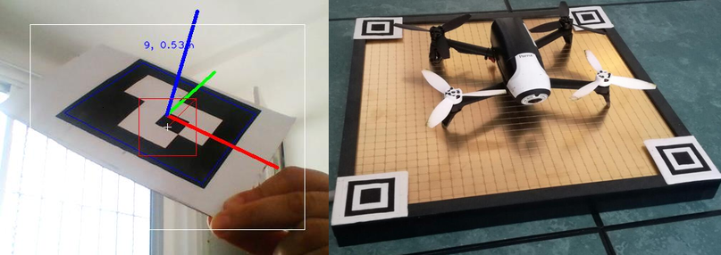

# Movimiento y navegación

 

 Los drones utilizados ofrecen un SDK, que permite además de obtener información de los sensores controlar su movimiento. Para navegar el entorno, calcular la posición actual e identificar puntos de interés se emplean marcadores. 

 Se utilizan dos tipo de marcadores, los marcadores de navegación y los marcadores de aterrizaje. Los marcadores de aterrizaje se ubican en los vertices de la platafroma de carga. Mediante dichos marcadores e información de la altura es posible estimar la pocición relativa de el drone con respecto a dicha plataforma. Esto permite poder alinear el drone a la plataforma y aterrizar sobre ella, para poder restablecer la  bateria del drone de forma autonoma.

 Los marcadores de navegación poseen un patrón único que los identifica y permite determinar su orientación. Además estos son ubicados en una ubiación absoluta conocida, por lo que mediante la estimación de la posición relativa y orientación con respecto al drone, se puede estimar la posición abloluta del drone. Esto permite definir patrones de vigilancia en base a dichos marcadores, reconocer sitios de interes y navegar hacia ellos.

