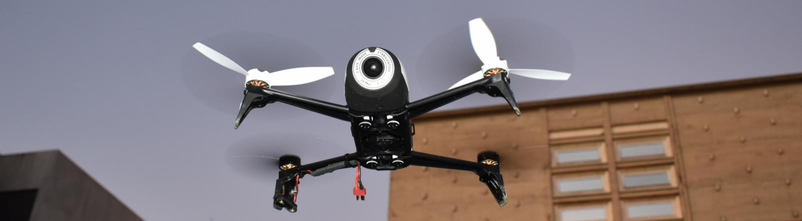

# Coodrinación de la flotilla

 

A pesar de que cada dron debe ser capaz de ser autonomo, toda la flotilla de drones deben trabajar de forma coordinada. El mecanismo de coordinación de la flotilla se basa en dos puntos claves: la comunicación y la toma de detecciones.

La comunicación permite  distribuir el estado de cada dron al resto de drones de la flotilla. Esta información incluye la tarea actual, la posición, el nivel de batería, la presencia de intrusos y su ubicación, entre otras cosas. Toda esta información es resumida en un mensaje y distribuida mediante broadcast. Para permitir la interconexión de los drones se utiliza una red inalámbrica. Esta red permite utilizar tanto una arquitectura centralizada utilizando puntos de acceso externos o utilizar la señal generada por los drones para una red de malla (mesh). 

La toma de decisiones permite utilizar toda la información recolectada directamente por el dron y la recolectada mediante la comunicación con el resto de la flotilla para tomar decisiones. Estas decisiones permiten a la flotilla trabajar como una unidad, colaborando para dar seguimiento a los intrusos y coordinar el uso de la plataforma de carga. Este mecanismo se basa en dos componentes básicos: la planificación fuera de linea que permite definir las rutas de patrullaje y una maquina de estados en ejecutada en linea. Esta máquina de estados es la que determina qué tarea debe realizar el dron en cada momento y las transiciones son provocadas por eventos percibidos por el propio dron o por el resto de drones de la flotilla.

